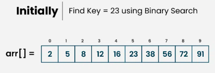
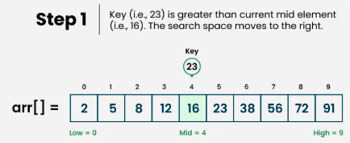
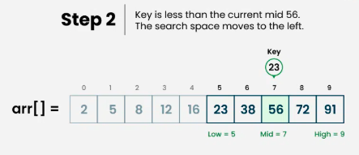
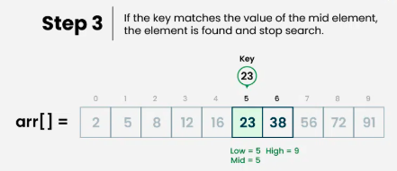

# What is Binary Search Algorithm?

**Binary search** is a search algorithm used to find the position of a target value within a sorted array. It works by repeatedly dividing the search interval in half until the target value is found or the interval is empty. The search interval is halved by comparing the target element with the middle value of the search space.

## Conditions to apply Binary Search Algorithm in a Data Structure:
To apply Binary Search algorithm:

- The data structure must be sorted.
- Access to any element of the data structure should take constant time.

**Binary Search Algorithm:**

Below is the step-by-step algorithm for Binary Search:

- Divide the search space into two halves by finding the middle index “mid”. 
- Compare the middle element of the search space with the key. 
- If the key is found at middle element, the process is terminated.
- If the key is not found at middle element, choose which half will be used as the next search space.
   - If the key is smaller than the middle element, then the left side is used for next search.
   - If the key is larger than the middle element, then the right side is used for next search.
- This process is continued until the key is found or the total search space is exhausted.
**How does Binary Search Algorithm work?**

To understand the working of binary search, consider the following illustration:

Consider an array arr[] = {2, 5, 8, 12, 16, 23, 38, 56, 72, 91}, and the target = 23.
(./images/your-image-file-name.extension)

