# Data Structures And Algorithms

## Why You Should Learn Data Structures and Algorithms

Whether you're pursuing a career in software development or data science, it's almost certain that you'll be asked to solve programming problems like **reversing a linked list** or **balancing a binary tree** in a technical interview or coding assessment.

It's well known, however, that you will almost never face these problems in your job as a software developer. So it's reasonable to wonder why such problems are asked in interviews and coding assessments. Solving programming problems demonstrates the following traits:

1. You can **think about a problem systematically** and solve it systematically step-by-step.
2. You can **envision different inputs, outputs, and edge cases** for programs you write.
3. You can **communicate your ideas clearly** to co-workers and incorporate their suggestions.
4. Most importantly, you can **convert your thoughts and ideas into working code** that's also readable.

It's not your knowledge of specific data structures or algorithms that's tested in an interview, but your approach towards the problem. You may fail to solve the problem and still clear the interview or vice versa. In this course, you will learn the skills to both solve problems and clear interviews successfully.

## Problem-Solving Strategy
Upon reading the problem, you may get some ideas on how to solve it and your first instinct might be to start writing code. This is not the optimal strategy and you may end up spending a longer time trying to solve the problem due to coding errors, or may not be able to solve it at all.

Here's a [**systematic problem-solving-strategy**](https://jovian.ai/aakashns/python-binary-search):

1. State **the problem clearly**. Identify the input & output formats.
2. Come up with some example **inputs & outputs**. Try to cover all edge cases.
3. Come up with a correct solution for the problem. State it in plain English.
4. Implement the solution and **test** it using example inputs. **Fix bugs**, if any.
5. Analyze **the algorithm's complexity** and identify inefficiencies, if any.
6. Apply the right technique to overcome the inefficiency. Repeat steps 3 to 6.

**"Applying the right technique"** is where the knowledge of common data structures and algorithms comes in handy.

[more details](https://jovian.ai/aakashns/python-binary-search) 
---

## **1. Linear Data Structures**
Linear data structures store elements in a sequential order, and each element is connected to its previous and next elements (where applicable).

- **Array**  
  A sequential arrangement of data elements paired with the index of the data element.  

  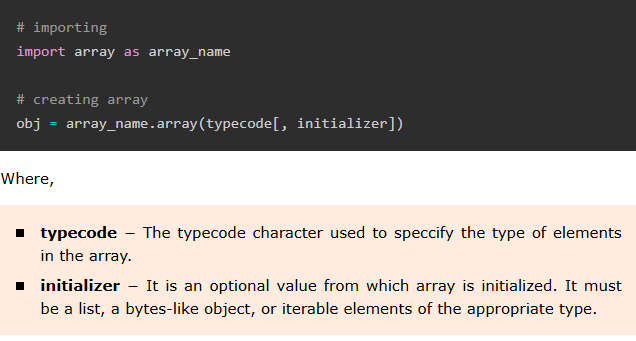

  **Example:** 

  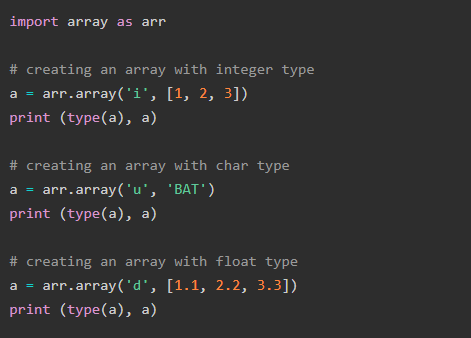

  It will produce the following output −

  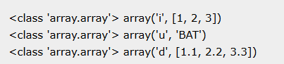

  Python array type is decided by a single character Typecode argument. The type codes and the intended data type of array is listed below −

  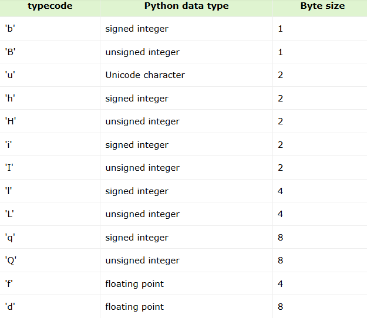

  **Basic Operations on Python Arrays:** 

  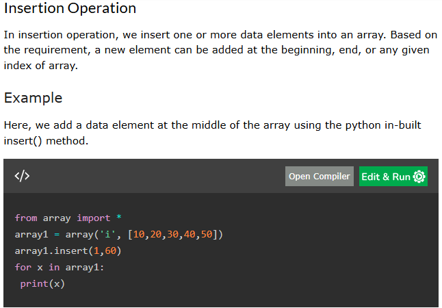

   **10**
   **60**
   **20**
   **30**
   **40**
   **50**

  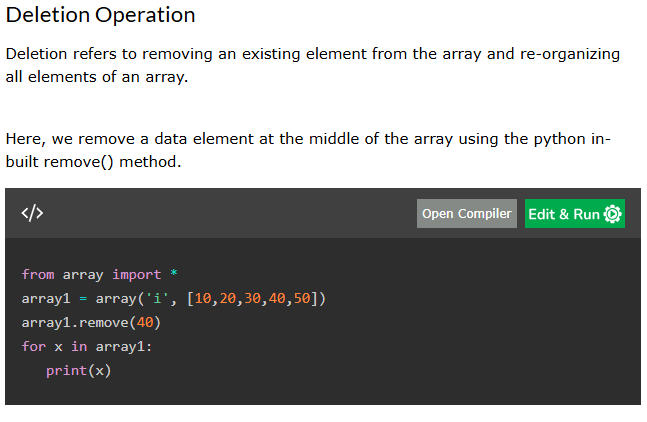

   **10**
   **20**
   **30**
   **50**

  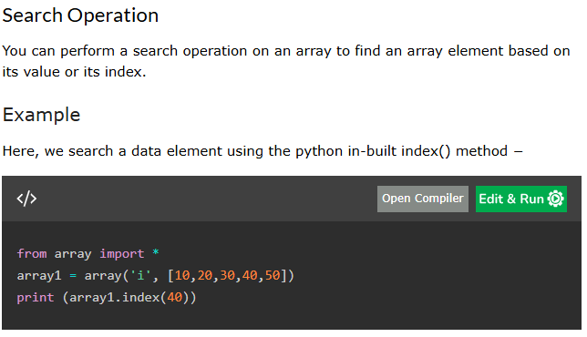

   **3**

  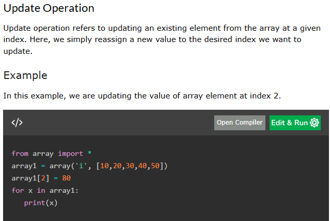

   **10**
   **20**
   **80**
   **40**
   **50**

  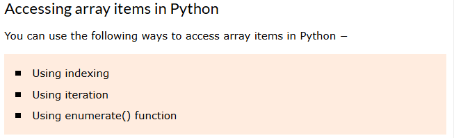

  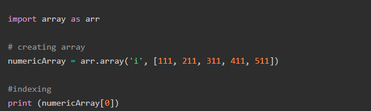

  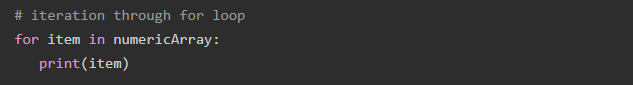

  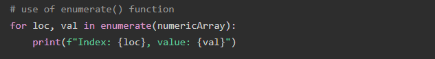

  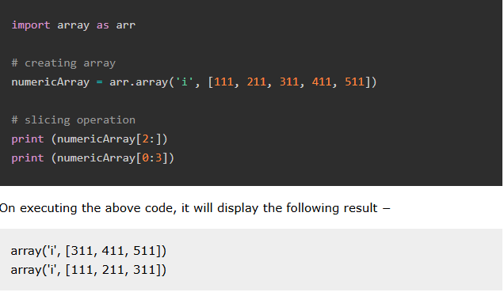

  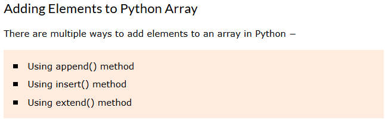

  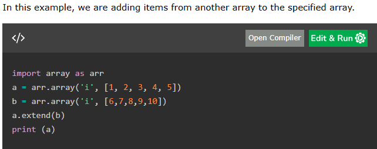

- **Linked List**  
  Each data element contains a link to another element, along with the data present in it.

- **Stack**  
  A data structure that follows a specific order of operation:  
  - **LIFO** (Last In, First Out) or  
  - **FILO** (First In, Last Out).

- **Queue**  
  Similar to Stack but follows a **FIFO** (First In, First Out) order of operation.

- **Matrix**  
  A two-dimensional data structure where each element is referred to by a pair of indices.

---

## **2. Non-Linear Data Structures**
Non-linear data structures do not store elements sequentially, and each element can connect to multiple elements.

- **Binary Tree**  
  A hierarchical data structure where each element (node) can have at most two children and begins with a root node.

- **Heap**  
  A specialized tree-based data structure where:  
  - The parent node's value is either greater than or equal to (Max-Heap) or  
  - Less than or equal to (Min-Heap) its child nodes.

- **Hash Table**  
  An array-like data structure where elements are accessed using keys rather than indices, utilizing a hash function.

- **Graph**  
  A set of vertices and edges where nodes (vertices) are connected by links (edges).

---

## **3. Python-Specific Data Structures**
Python provides specialized data structures that enhance flexibility and performance.

- **List**  
  Similar to an array but can store elements of different data types, such as numbers and strings.

- **Tuple**  
  Similar to a list but **immutable**, meaning its values cannot be modified after creation.

- **Dictionary**  
  Stores data in **Key-Value Pairs**, allowing fast access using keys instead of indices.

